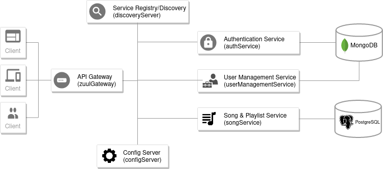

# Spring Microservices Demo

Spring Microservices Demo is a web application that provides a RESTful backend for managing songs, playlists and users.\
The following diagram visualizes the implemented microservice architecture:

||
|----|

The web application consists of the following [Spring Boot](https://spring.io/projects/spring-boot) applications:

| Module        | Description                                 | Technologies |
| ------------: |:--------------------------------------------| :-------------|
| [configServer](https://github.com/janis-schanbacher/spring-microservices-demo/tree/master/configServer) | Config server that retrieves configurations from a [github-repository](https://github.com/janis-schanbacher/spring-cloud-configs) | [Spring Cloud Config Server](https://cloud.spring.io/spring-cloud-config/multi/multi__spring_cloud_config_server.html) |
| [discoveryServer](https://github.com/janis-schanbacher/spring-microservices-demo/tree/master/discoveryServer) | Server for service registry/discovery | [Eureka Server](https://cloud.spring.io/spring-cloud-netflix/multi/multi_spring-cloud-eureka-server.html) |
| [zuulGateway](https://github.com/janis-schanbacher/spring-microservices-demo/tree/master/zuulGateway) | Gateway for routing and jwt-token validation | [Zuul Gateway](https://cloud.spring.io/spring-cloud-netflix/multi/multi__router_and_filter_zuul.html), [Spring Security](https://spring.io/projects/spring-security#overview), [JJWT](https://java.jsonwebtoken.io/) |
| [authService](https://github.com/janis-schanbacher/spring-microservices-demo/tree/master/authService) | Microservice for authenticating users | [Spring Security](https://spring.io/projects/spring-security#overview), [JJWT](https://java.jsonwebtoken.io/), [MongoDB](https://www.mongodb.com/) |
| [userManagementService](https://github.com/janis-schanbacher/spring-microservices-demo/tree/master/userManagementService) | Microservice for managing users | [MongoDB](https://www.mongodb.com/) |
| [songService](https://github.com/janis-schanbacher/spring-microservices-demo/tree/master/songService) | Microservice for managing songs (metadata) and playlists | [Hibernate](https://hibernate.org/), [PostgreSQL](https://www.postgresql.org/) |


## Getting Started
### Prerequisites
- [Java 11](https://openjdk.java.net/projects/jdk/11/)
- [Maven](https://maven.apache.org/)
- [MongoDB](https://docs.mongodb.com/manual/tutorial/install-mongodb-on-ubuntu/)

### Start MondgoDB
- Create a directory for the database
    ```sh
    mkdir data-mongodb
    ```

- Run the daemon
    ```sh
    mongod --dbpath=./data-mongodb
    ```

- Create `user-db` database in mongo shell
    ```sh
    mongo
    ```
    - From mongo shell run
        ```
        use user-db
        ```

- Alternatively use the [makefile](https://github.com/janis-schanbacher/spring-microservices-demo/blob/master/makefile)
    ```sh
    make mongo-db-up
    ```
    - Shutdown
    ```sh
    make mongo-db-down
    ```

### Run the application
- Start the config server
    ```sh
    cd configServer/ && mvn spring-boot:run ; cd -
    ```
- Start the all modules in your preferred IDE
    - Alternatively run the following lines in separate terminals
        ```sh
        cd discoveryServer/ && mvn spring-boot:run ; cd -
        cd userManagementService/ && mvn spring-boot:run ; cd -
        cd authService/ && mvn spring-boot:run ; cd -
        cd songService/ && mvn spring-boot:run ; cd -
        cd zuulGateway/ && mvn spring-boot:run ; cd -
        ```
<!--
    - Alternatively use the [makefile](https://github.com/janis-schanbacher/spring-microservices-demo/blob/master/makefile) to run services in background
        ```sh
        make services-up
        ```
        - Shutdown: get process ids and kill the processes
            ```sh
            make get-running-processes
            kill -9 <pid>
            ```
-->

## Usage
- Access the services through the gateway by using the following base URL:
  [http://localhost:8762/api/](http://localhost:8762/api/)

- Create a user
    ```sh
    curl --location --request POST 'http://localhost:8762/api/users/' \
    --header 'Content-Type: application/json' \
    --data-raw '{
        "username": "username",
        "firstName": "firstName",
        "lastName": "lastName",
        "password": "password"
    }'
    ```
    - The Database will be seeded with the users defined in [/userManagementService/src/main/java/com/janisschanbacher/springmicroservicesdemo/usermanagementservice/config/MongoDBConfig.java](https://github.com/janis-schanbacher/spring-microservices-demo/blob/master/userManagementService/src/main/java/com/janisschanbacher/springmicroservicesdemo/usermanagementservice/config/MongoDBConfig.java)
        - Credentials an admin: `{ "userId":"admin", "password":"pass1234" }`

- Login. Use the returned Authorization header for requests that require authentication.
    ```sh
    curl --location --request POST 'http://localhost:8762/api/auth' \
    --header 'Content-Type: application/json' \
    --data-raw '{
        "userId":"username",
        "password":"password"
    }'
    ```

- Get all songs
    ```sh
    curl --location --request GET 'http://localhost:8762/api/songs' \
    --header 'Authorization: <Replace with Bearer token>'
    ```

- Create a song
    ```sh
    curl --location --request POST 'http://localhost:8762/api/songs' \
    --header 'Content-Type: application/json' \
    --header 'Authorization: <Replace with Bearer token>' \
    --data-raw '{
        "title": "title",
        "artist": "artist",
        "label": "label",
        "released": 2020
    }'
    ```

- Create a playlist
    ```sh
      curl --location --request POST 'http://localhost:8762/api/songlists' \
      --header 'Authorization: <Replace with Bearer token>' \
      --header 'Content-Type: application/json' \
      --data-raw '{
          "isPrivate": false,
          "name": "playlist",
        "songList": [
              { "id": 4 },
              { "id": 8 }
          ]
      }'
    ```

- Get playlists of a user (public playlists, or all if requesting the current users playlists)
    ```sh
    curl --location --request GET 'http://localhost:8762/api/songlists?userId=username' \
    --header 'Authorization: <Replace with Bearer token>' \
    --header 'Content-Type: application/json'
    ```

### Available Routes
All routes are accessible through the following base URL:
[http://localhost:8762/api/](http://localhost:8762/api/)
- POST /auth
- GET, POST /users
    - GET requires ADMIN role
- GET, PUT, DELETE /users/{username}
    - GET requires ADMIN role or else username to specify the current user
- GET, POST /songs
- GET, PUT, DELETE /songs/{id}
- GET, POST /songlists
- GET, PUT, DELETE /songlists/{id}
- GET /version, /config/version, /discovery/version, /gateway/version, /auth/version, /users/version, /songs/version
